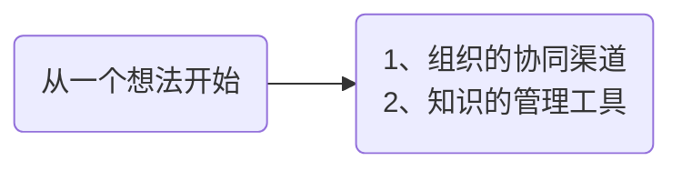
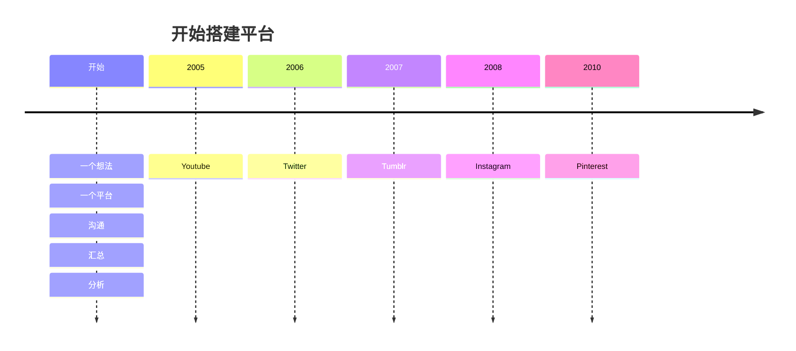
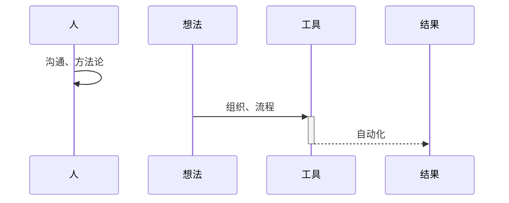
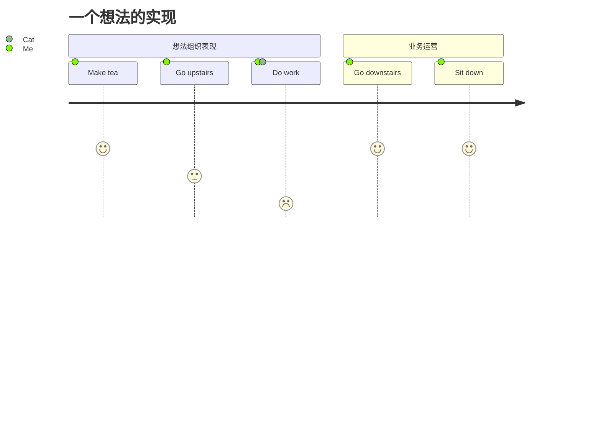
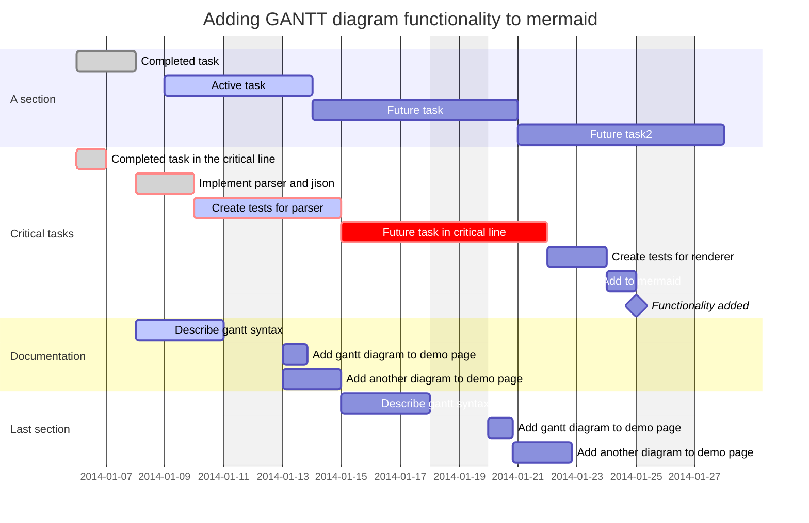
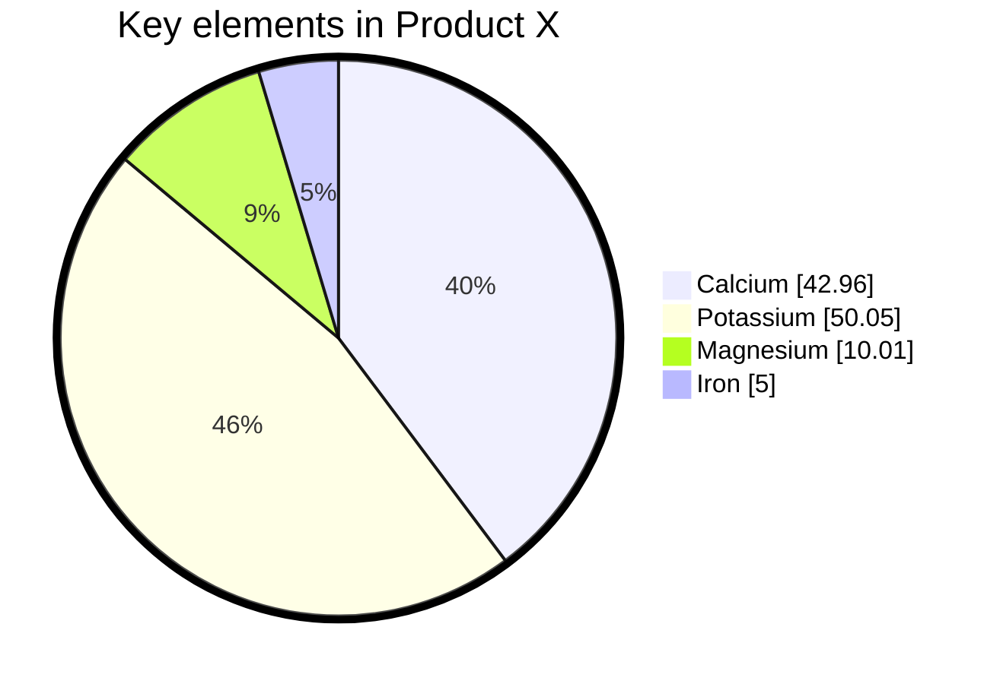
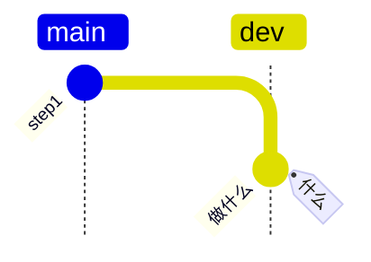
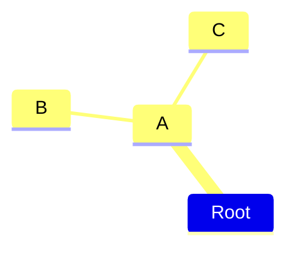

# a Project Container

> ==一个想法的实现==，从**想法**开始，去做一个**实现**想法的拓展过程，一个想法就是一个高层的构架开始。
>
> ==什么== ==怎么做== ==结果==
>
> 

## 开始于一个想法

> [!tip]
>
> 这里需要一个理论的书籍支撑我的开始理论依据。
>
> 





组织：













```mermaid

```

