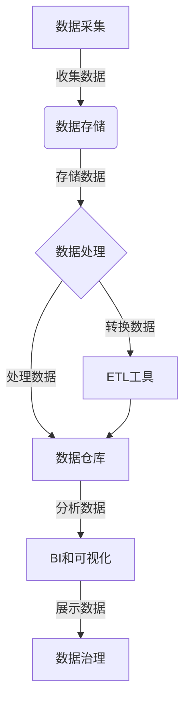
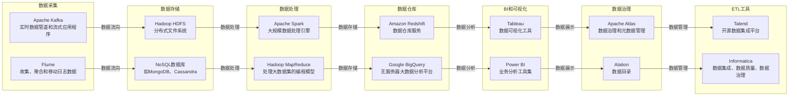
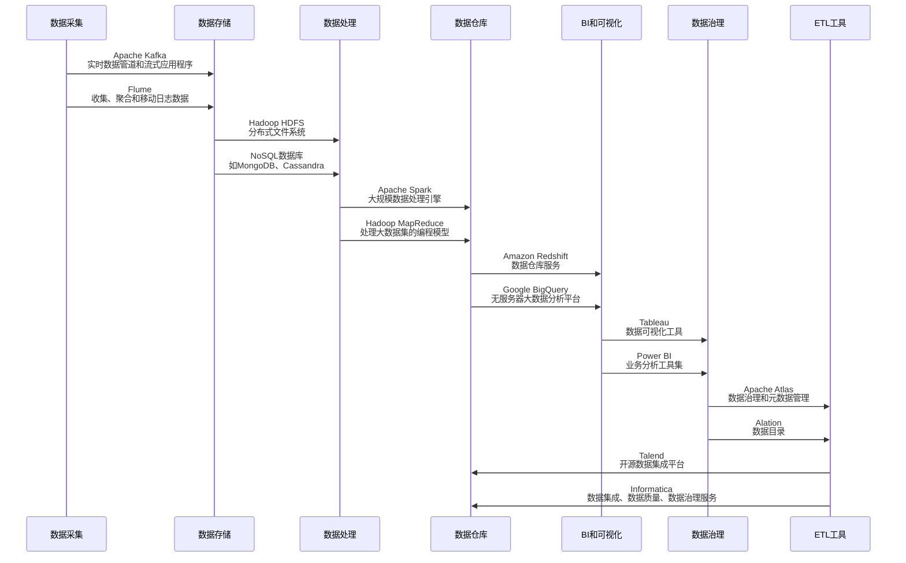

# 数据体系搭建

> 因子分析

```mermaid
graph TD
    A[数据采集] -->|收集数据| B(数据存储)
    B -->|存储数据| C{数据处理}
    C -->|处理数据| D[数据仓库]
    D -->|分析数据| E[BI和可视化]
    E -->|展示数据| F[数据治理]
    C -->|转换数据| G[ETL工具]
    G --> D
```

```mermaid
flowchart LR
    subgraph 数据采集
    Kafka[Apache Kafka<br>实时数据管道和流式应用程序]
    Flume[Flume<br>收集、聚合和移动日志数据]
    end

    subgraph 数据存储
    HDFS[Hadoop HDFS<br>分布式文件系统]
    NoSQL[NoSQL数据库<br>如MongoDB、Cassandra]
    end

    subgraph 数据处理
    Spark[Apache Spark<br>大规模数据处理引擎]
    MapReduce[Hadoop MapReduce<br>处理大数据集的编程模型]
    end

    subgraph 数据仓库
    Redshift[Amazon Redshift<br>数据仓库服务]
    BigQuery[Google BigQuery<br>无服务器大数据分析平台]
    end

    subgraph BI和可视化
    Tableau[Tableau<br>数据可视化工具]
    PBI[Power BI<br>业务分析工具集]
    end

    subgraph 数据治理
    Atlas[Apache Atlas<br>数据治理和元数据管理]
    Alation[Alation<br>数据目录]
    end

    subgraph ETL工具
    Talend[Talend<br>开源数据集成平台]
    Informatica[Informatica<br>数据集成、数据质量、数据治理]
    end

    Kafka -->|数据流向| HDFS
    Flume -->|数据流向| NoSQL
    HDFS -->|数据处理| Spark
    NoSQL -->|数据处理| MapReduce
    Spark -->|数据存储| Redshift
    MapReduce -->|数据存储| BigQuery
    Redshift -->|数据分析| Tableau
    BigQuery -->|数据分析| PBI
    Tableau -->|数据展示| Atlas
    PBI -->|数据展示| Alation
    Atlas -->|数据管理| Talend
    Alation -->|数据管理| Informatica

```

```mermaid
sequenceDiagram
    participant 数据采集
    participant 数据存储
    participant 数据处理
    participant 数据仓库
    participant BI和可视化
    participant 数据治理
    participant ETL工具

    数据采集->>数据存储: Apache Kafka<br>实时数据管道和流式应用程序
    数据采集->>数据存储: Flume<br>收集、聚合和移动日志数据
    数据存储->>数据处理: Hadoop HDFS<br>分布式文件系统
    数据存储->>数据处理: NoSQL数据库<br>如MongoDB、Cassandra
    数据处理->>数据仓库: Apache Spark<br>大规模数据处理引擎
    数据处理->>数据仓库: Hadoop MapReduce<br>处理大数据集的编程模型
    数据仓库->>BI和可视化: Amazon Redshift<br>数据仓库服务
    数据仓库->>BI和可视化: Google BigQuery<br>无服务器大数据分析平台
    BI和可视化->>数据治理: Tableau<br>数据可视化工具
    BI和可视化->>数据治理: Power BI<br>业务分析工具集
    数据治理->>ETL工具: Apache Atlas<br>数据治理和元数据管理
    数据治理->>ETL工具: Alation<br>数据目录
    ETL工具->>数据仓库: Talend<br>开源数据集成平台
    ETL工具->>数据仓库: Informatica<br>数据集成、数据质量、数据治理服务

```

